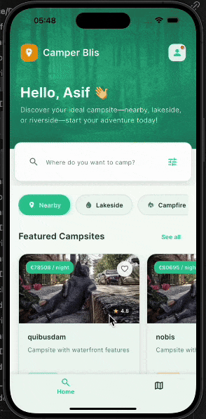
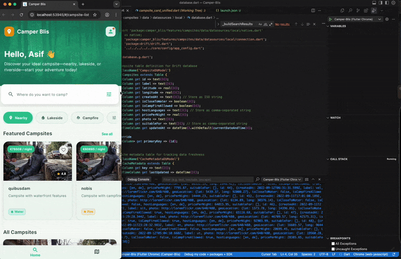

# 🏕️ Camper Blis

[](https://flutter.dev)
[](https://dart.dev)
[](https://github.com/your-repo/camper-blis)

**Camper Blis** is a modern, cross-platform campsite discovery platform built with Flutter. It provides users with an intuitive interface to discover, search, and explore campsites with detailed information, interactive maps, and advanced filtering capabilities.

## 🌟 Features

### 🔍 **Campsite Discovery**
- Browse featured and all available campsites
- Advanced search functionality with text-based queries
- Multi-criteria filtering (water access, campfire allowed, host languages, etc.)
- Real-time search results with optimized performance

### 🗺️ **Interactive Maps**
- Interactive map view with campsite markers
- Marker clustering for better visualization
- Zoom controls and location details
- Popup information cards for quick campsite preview

### 📱 **Responsive Design**
- Optimized layouts for mobile, tablet, and desktop
- Adaptive grid layouts and card designs
- Consistent user experience across all platforms

### 🏕️ **Detailed Campsite Information**
- Comprehensive campsite details and descriptions
- Photo galleries and visual content
- Pricing information and availability
- Host language support
- Amenity listings (water access, campfire permissions, etc.)
- Location coordinates and accessibility information

### 🎯 **Smart Filtering**
- Filter by water proximity
- Campfire allowance options
- Host language preferences
- Price range selection

## 🏗️ Architecture

This project follows **Clean Architecture** principles with clear separation of concerns:

```
lib/
├── core/                    # Core application modules
│   ├── config/             # App configuration and environment settings
│   ├── constants/          # API constants and global values
│   ├── error/              # Error handling and custom exceptions
│   ├── layout/             # Main navigation and layout components
│   ├── navigation/         # App routing and navigation logic
│   ├── network/            # HTTP client and network utilities
│   ├── providers/          # Dependency injection providers
│   └── utils/              # Utility functions and helpers
├── features/               # Feature-based modules
│   └── campsites/
│       ├── data/           # Data layer (repositories, datasources, models)
│       ├── domain/         # Domain layer (entities, repositories, use cases)
│       └── presentation/   # Presentation layer (pages, widgets, controllers)
└── shared/                 # Shared components and resources
    ├── constants/          # App-wide constants
    ├── theme/              # Theme configuration and styling
    └── widgets/            # Reusable UI components
```

### 🔧 **Tech Stack**

| Category | Technologies |
|----------|-------------|
| **Framework** | Flutter 3.7.2+ |
| **Language** | Dart |
| **State Management** | Riverpod 2.5.1 |
| **Database** | Drift (SQLite) |
| **HTTP Client** | Dio |
| **Maps** | Flutter Map with Marker Clustering |
| **Navigation** | Go Router |
| **Image Caching** | Cached Network Image |
| **Code Generation** | Freezed, JSON Serializable |
| **Error Handling** | Dartz (Either type) |
| **Environment Config** | Flutter DotEnv |

## 🚀 Getting Started

### Prerequisites

- Flutter SDK 3.7.2 or higher
- Dart SDK 3.0.0 or higher
- Android Studio / VS Code with Flutter extensions
- Git

### Installation

1. **Clone the repository**
   ```bash
   git clone https://github.com/your-username/camper-blis.git
   cd camper-blis
   ```

2. **Install dependencies**
   ```bash
   flutter pub get
   ```

3. **Generate code**
   ```bash
   dart run build_runner build
   ```

4. **Set up environment variables**
   ```bash
   cp .env.example .env
   # Edit .env file with your configuration
   ```

5. **Run the application**
   ```bash
   flutter run
   ```

### Available Platforms

- ✅ **iOS** (iOS 12.0+)
- ✅ **Web** (Progressive Web App)

## 📱 Demo

### iOS Demo


### Web Demo


## 👥 Author

**Muhammad Asif Jawed**  
Senior Flutter Developer
